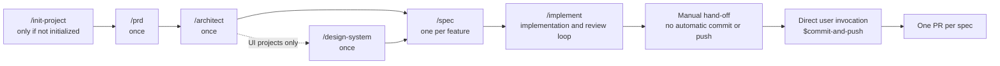
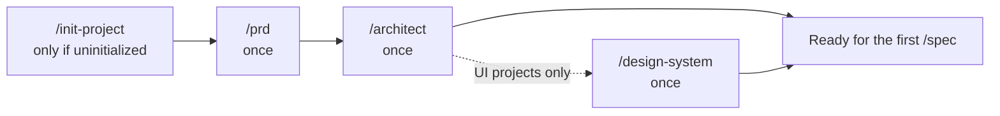
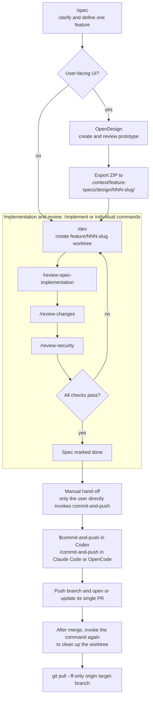

> **To initialize a project from this starter, clone the repo and run:**
>
> ```
> /init-project
> ```

# agentic-starter

A stack-agnostic starter for building projects with Codex, Claude Code, OpenCode, or another local coding agent, following a **Spec-Driven Development (SDD)** workflow. It ships the agentic tooling layer only - no application code - so it works with whatever backend, frontend, and hosting you choose.



## What's included

- **`.context/`** - the project's persistent context: architecture, conventions, progress tracking, feature specs, and a small memory system for decisions and corrections. See `.context/ai-workflow-entrypoint.md` for the full read order.
- **`.context/project-settings.md`** - project-specific settings: target branch, PR confirmation, optional OpenDesign URL, and the test/typecheck commands the pipeline runs. Every spec uses one feature branch and one PR.
- **`.context/stacks/`** - ready-made **stack recipes**. Each one is a self-contained bootstrap + reference doc for a specific combination of backend, frontend, and hosting (e.g. `symfony-nextjs-contabo.md`). `/init-project` picks one, or helps you draft a new one if none fits - the library grows over time.
- **`.context/coding-conventions/`** - one file per language/framework (`global.md` and `security.md` apply to every project; the rest - `php.md`, `symfony.md`, `typescript.md`, `nextjs.md`, `react.md`, `javascript.md`, `tailwind.md`, `twig.md`, `stimulus.md`, `ui.md` - apply only if your chosen stack uses them). `/init-project` deletes the ones your chosen recipe doesn't pair with, so a real project only ever keeps what it actually needs.
- **Commands and agents**, mirrored across tools (`.codex/`, `.claude/`, `.opencode/`) so the workflow is the same regardless of which local coding agent you use:
  - `/prd` → `/architect` → `/design-system` - framing, run once per project before the first `/spec`
  - `/spec` → `/implement` - the feature pipeline (implementation, spec verification, conventions, and security review, looped until clean)
  - `/status` - shows the project's framing state and every spec's pipeline stage, derived entirely from files and read-only git/gh queries
  - `/review-changes`, `/review-security` - convention/security sweeps over local changes
  - `/init-project` - bootstrap or wire up a project from a stack recipe
  - `/setup-backup`, `/setup-rolling-deploy`, `/teardown-rolling-deploy` - infra runbooks (currently only implemented for the `symfony-nextjs-contabo` recipe)
  - `/commit-and-push`, `/add-new-color`, `/just-respond`
- **`infra/`** - deploy scripts and nginx configs matching the current stack recipes; irrelevant/unused pieces get removed by `/init-project` once a stack is chosen.
- **`.github/workflows/`** - CI/CD workflow(s) matching the current stack recipes.
- **`.githooks/pre-commit`** - a plain git hook (not tool-specific): refuses a commit on a `feature/<slug>` branch unless that spec exists and `/dev` has picked it up. Activated once per clone by `/init-project` (`git config core.hooksPath .githooks`), so it holds no matter which AI tool - or none - is committing.

**Commit and push require a direct user command.** `$spec`, `$dev`, `$implement`, quick fixes, and reviews never commit, push, or invoke the commit-and-push command automatically. Only when you directly call `$commit-and-push` in Codex or `/commit-and-push` in another tool does the agent run its commit and push workflow.

## AI Development workflow

Context and conventions live in `.context/` - start with `.context/ai-workflow-entrypoint.md` (also linked from `AGENTS.md`/`CLAUDE.md`).

The command names below use slash notation for readability. Codex invokes the matching dollar-prefixed skill (for example, `$spec`, `$implement`, and `$commit-and-push`); Claude Code and OpenCode use slash commands. All three follow the same canonical instructions in `.context/commands/`.

**Two paths:**

**Quick fixes** (bugs, typos, small corrections - ≤ 3 files, no new feature): write code directly, no pipeline needed.

**Features**: framing once, then the per-spec pipeline repeats for every feature:

```
/prd → /architect → /design-system     (once, before the first /spec)
/spec → /implement                     (repeats, once per feature)
```

### Framing (once)

Run `/init-project` first if the project isn't bootstrapped yet. It configures the branch, PR, test, and optional OpenDesign settings along with the stack context. Then run `/prd`, `/architect`, and (for UI projects) `/design-system` manually, one at a time, before the first `/spec`. Repeat framing later only if the documented product or architecture has drifted.



| Command | What it does |
| --- | --- |
| `/init-project` | Only if the project isn't initialized yet - bootstraps the stack context and configures the workflow settings |
| `/prd` | Frames the product: problem, perimeter, out-of-scope, success criteria - writes `.context/framing/prd.md` |
| `/architect` | Reconciles `.context/architecture.md` and conventions with the real codebase |
| `/design-system` | UI projects only - locks design tokens and a contrast audit into `.context/ui-context.md` |

### Per-spec cycle

Each spec gets its own dedicated git worktree, `.worktrees/NNN-slug/` on branch `feature/NNN-slug` - one spec, one worktree, one branch, one PR. `/dev` creates it and brings the spec and design export into it; every later command resolves that worktree rather than assuming the session is already sitting inside it. `/commit-and-push` removes it only after the PR is proven merged.



| Command | What it does |
| --- | --- |
| `/spec` | Explicitly classifies whether the feature has user-facing UI. UI specs use OpenDesign and include its exported files under `.context/feature-specs/design/`; non-UI specs skip design. The spec and handoff are shared across Codex, Claude Code, and OpenCode. |
| `/implement` | Runs `/dev` → `/review-spec-implementation` → `/review-changes` → `/review-security` in series, looping (up to 5 iterations) until everything checks out, and marks the spec done |

`/implement` is the recommended entry point for a feature - it's `/dev`, `/review-spec-implementation`, `/review-changes`, and `/review-security` wired together into one self-correcting loop. It never commits or pushes: `/commit-and-push` is always a separate, manual step after `/implement` hands off. Each of the four stays available individually for a narrower job (e.g. running `/review-security` alone after a manual edit).

Specs live in `.context/feature-specs/` as Markdown files with `status: todo / in-progress / done`. UI exports live in `.context/feature-specs/design/<NNN-slug>/` and travel with the spec branch. `/commit-and-push` pushes that branch and opens or updates its single PR against `Target branch`. Run `/status` at any point to see framing, design handoff, worktree, verification, and PR state.

After the PR merges and `/commit-and-push` safely cleans up its worktree, fast-forward the primary checkout with `git pull --ff-only origin <target-branch>` before starting the next spec.

### OpenDesign and local coding agents

OpenDesign is the design workspace; Codex, Claude Code, or OpenCode remains the local coding agent. For a UI spec, the local agent prepares a design brief, you create and review the prototype in the configured OpenDesign browser workspace, then export the project as a ZIP and extract it to `.context/feature-specs/design/<NNN-slug>/`. The local agent reads that committed design reference from the feature worktree. This file handoff is tool-agnostic and does not require connecting each coding agent to OpenDesign MCP.

## Getting started

Run `/init-project` (or read `INIT.md` directly) to either bootstrap a fresh project from a stack recipe, or wire an existing project into this structure.

Each developer machine also needs the GitHub CLI installed and authenticated (`gh auth login`) to open, inspect, and clean up per-spec pull requests. `/init-project` checks this prerequisite without storing credentials in the repository.

### Updating an already initialized project

Do not rerun `/init-project` on a project that has already removed `INIT.md` and `.context/stacks/`. Merge these workflow files from the starter, preserving the project's actual `Target branch`, test, and typecheck values in `.context/project-settings.md`:

- `.context/ai-workflow-entrypoint.md`, `.context/project-settings.md`, and the canonical `.context/commands/{spec,dev,implement,status,review-spec-implementation,commit-and-push}.md` files.
- The corresponding native command wrappers under `.claude/commands/`, `.codex/skills/`, and `.opencode/commands/`; they should delegate to the canonical files.
- The `INIT.md` changes if that project still keeps its initialization guide.

Remove the old `Merge mode` setting and add the project's OpenDesign workspace URL if it has a UI. Completed legacy specs do not need retroactive UI metadata or design exports; new specs created with the updated `/spec` command use the new handoff. On each developer machine, install and authenticate `gh` once, then sign in to the configured OpenDesign URL in a browser. OpenDesign exports live in the feature branch, so the local coding agent does not need a separate OpenDesign MCP installation.

## Security review rule updates

`$review-security` in Codex (`/review-security` in Claude Code and OpenCode) keeps `.context/coding-conventions/security.md` as the project's authority and uses the [OWASP Secure Coding Markdown compilation](https://github.com/vchirrav-eng/owasp-secure-coding-md) for supplementary rule IDs. The shared updater downloads only `rules/*.md` into the Git ignored `.cache/security-rules/` directory. Agents run it from `.context/ai-workflow-entrypoint.md` when a session starts; it checks upstream at most once every seven days after a successful download, retries failed refreshes at the next session, and keeps the last valid snapshot if the network is unavailable. Review reports include the source commit SHA.

For an existing project created from an older starter, migrate its workflow files once: copy `.context/scripts/update-security-rules.py`, merge the new startup instruction into `.context/ai-workflow-entrypoint.md`, and merge `.context/commands/review-security.md` plus the matching `.claude/commands/`, `.codex/skills/`, `.opencode/commands/`, and `security-reviewer` agent definitions. Add `.cache/security-rules/` to `.gitignore`, then remove the old `security-review-ecc` skill copies and references. Preserve that project's own `security.md` and any local review customizations. The first session after migration downloads the rules.

On a new computer, clone the project and make sure Python 3 and Git are available. The first session needs network access to create the cache. Because the upstream repository currently declares no redistribution license, this starter does not commit a copy of its rules; a new clone without network access cannot complete the supplementary review until its first download succeeds.

## Built with

[Claude Code CLI](https://claude.ai/code)
