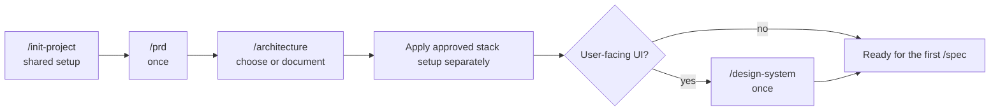
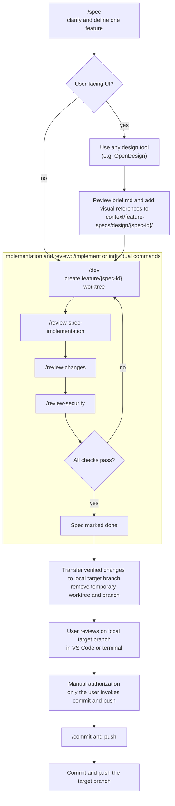

> **To start a new project, clone this repo. To add the starter workflow to an existing project, copy the starter files into it. Then run:**
>
> ```
> /init-project
> ```

# agentic-starter

A stack-agnostic starter for building projects with Claude Code, OpenCode, or another local coding agent, following a **Spec-Driven Development (SDD)** workflow. It ships the agentic tooling layer only - no application code - so it works with whatever backend, frontend, and hosting you choose.

```mermaid
flowchart LR
  init["/init-project<br/>shared setup"] --> prd["/prd<br/>once"]
  prd --> arch["/architecture<br/>choose or document"]
  arch --> setup["Apply approved stack setup<br/>separately for new projects"]
  setup --> ui{"User-facing UI?"}
  ui -- no --> spec["/spec<br/>one per feature"]
  ui -- yes --> design["/design-system<br/>once"]
  design --> spec
  spec --> implement["/implement<br/>one spec"]
  spec --> parallel["/parallel-implement<br/>several selected specs"]
  implement --> handoff["Manual hand-off<br/>no automatic commit or push"]
  parallel --> handoff
  handoff --> review["User reviews uncommitted changes<br/>on the local target branch"]
  review --> ship["Direct user invocation<br/>/commit-and-push"]
  ship --> push["Commit and push target branch"]
```



## What's included

- **`.context/`** - the project's persistent context: architecture, conventions, progress tracking, feature specs, and a small memory system for decisions and corrections. See `.context/ai-workflow-entrypoint.md` for the full read order.
- **`.context/project-settings.md`** - project-specific settings: target branch, optional design workspace URL, and the test/typecheck commands the pipeline runs. Each spec gets a temporary local worktree and branch; verified changes are reviewed on the local target branch. The workflow creates no PRs.
- **`.context/stacks/`** - stack-specific architecture and setup recipes. `/architecture` may consult them as examples after learning the product constraints; they are not a closed menu, and `/init-project` never selects or executes one. Apply an approved recipe separately after the architecture decision.
- **`.context/coding-conventions/`** - shared rules plus language/framework guidance for supported stacks. Keep these reference files intact; read the ones matching the architecture documented in `.context/architecture.md`.
- **Commands and agents**, mirrored across tools (`.claude/`, `.opencode/`) so the workflow is the same regardless of which local coding agent you use:
  - `/init-project` → `/prd` → `/architecture` → approved stack setup (separate step, if needed) → `/design-system` for UI projects - framing before the first `/spec`
  - `/spec` → `/implement` - the feature pipeline (implementation, spec verification, conventions, and security review, looped until clean)
  - `/parallel-implement` - implements multiple selected specs concurrently, integrates their verified diffs, and provides resumable worktree cleanup
  - `/status` - shows the project's framing state and every spec's pipeline stage, derived entirely from files and read-only Git queries
  - `/review-changes`, `/review-security` - convention/security sweeps over local changes
  - `/init-project` - set up shared project context and workflow settings without choosing a stack
  - `/setup-backup`, `/setup-rolling-deploy`, `/teardown-rolling-deploy` - infra runbooks (currently only implemented for the `symfony-nextjs-contabo` recipe)
  - `/commit-and-push`, `/add-new-color`, `/just-respond`
- **`infra/`** - reference deploy scripts and nginx configurations for the supported stack recipes; stack-specific setup is applied separately.
- **`.github/workflows/`** - CI/CD examples matching the current stack recipes; they are not installed or selected by `/init-project`.
- **`.githooks/pre-commit`** - a plain git hook (not tool-specific): refuses a commit on a `feature/<spec-id>` branch unless that spec exists and `/dev` has picked it up. The normal workflow transfers reviewed changes to the target branch before the user-authorized commit. Activated once per clone when `/init-project` initializes the shared workflow (`git config core.hooksPath .githooks`), so it applies regardless of which AI tool is committing.

**Commit and push require a direct user command.** `/spec`, `/dev`, `/implement`, `/parallel-implement`, quick fixes, and reviews never commit, push, or invoke the commit-and-push command automatically. Only when you directly call `/commit-and-push` does the agent run its commit and push workflow.

## AI Development workflow

Context and conventions live in `.context/` - start with `.context/ai-workflow-entrypoint.md` (also linked from `AGENTS.md`/`CLAUDE.md`).

The command names below use slash notation for readability. Claude Code and OpenCode both use slash commands (for example, `/spec`, `/implement`, and `/commit-and-push`) and follow the same canonical instructions in `.context/commands/`.

**Two paths:**

**Quick fixes** (bugs, typos, small corrections - ≤ 3 files, no new feature): write code directly, no pipeline needed.

**Features**: framing once, then the per-spec pipeline repeats for every feature:

```
/init-project → /prd → /architecture → approved stack setup (if needed) → /design-system (UI projects) → /spec
/spec → /implement                     (repeats, once per feature)
```

Use `/parallel-implement <spec-id-or-file> <spec-id-or-file> [...]` when at least two independent, already planned specs are ready together. You can pass exact IDs or drag and drop the `.md` spec files into any of these commands; their local `file:///...` URLs are resolved and checked against the current checkout. `/dev` / `/dev` and `/implement` / `/implement` accept the same file selectors, along with their existing name-fragment lookup.

### Framing (once)

Run `/init-project` to populate shared project context and workflow settings without choosing a stack. Then run `/prd` and `/architecture` manually, one at a time. For a new project, apply approved stack-specific setup separately if needed; run `/design-system` for UI projects once the UI stack and its tokens exist. `/spec` is blocked until shared initialization, the PRD, architecture, and (for UI projects) the design system are complete. Repeat framing later only if the documented product or architecture has drifted.



| Command | What it does |
| --- | --- |
| `/init-project` | Sets up shared project context and workflow settings; does not choose or bootstrap a stack |
| `/prd` | Frames the product: problem, perimeter, out-of-scope, success criteria - writes `.context/framing/prd.md` |
| `/architecture` | Chooses and documents architecture for a new project, or documents the actual architecture of an existing codebase |
| `/design-system` | UI projects only - locks design tokens and a contrast audit into `.context/ui-context.md` |

### Per-spec cycle

Each new spec uses a UTC ID in `yyyy_mm_dd_hh_ii_ss-spec-title` format (for example, `2026_09_27_15_42_31-add-search`). It gets its own temporary worktree, `.worktrees/<spec-id>/`, on a local branch `feature/<spec-id>` - one spec, one worktree, one branch, no PR. Existing numeric spec IDs remain supported. `/dev` creates the worktree and brings the spec and its design handoff into it; later commands resolve that worktree rather than assuming the session is already sitting inside it. Once implementation, spec verification, convention review, and security review pass, the verified changes are transferred to the configured local target branch as uncommitted, unstaged changes. The worktree and feature branch are removed after the transfer is verified.



| Command | What it does |
| --- | --- |
| `/spec` | Explicitly classifies whether the feature has user-facing UI. UI specs may use any design tool (OpenDesign is one example) and include reviewed, versioned design references under `.context/feature-specs/design/`; non-UI specs skip design. The spec and handoff are shared across coding agents. |
| `/parallel-implement` | Runs the implementation and review loop for multiple selected specs concurrently, integrates their diffs for local review, and records resumable cleanup state |
| `/implement` | Runs `/dev` → `/review-spec-implementation` → `/review-changes` → `/review-security` in series, looping (up to 5 iterations) until everything checks out, and marks the spec done |

`/implement` is the recommended entry point for a feature - it's `/dev`, `/review-spec-implementation`, `/review-changes`, and `/review-security` wired together into one self-correcting loop. It never commits or pushes: `/commit-and-push` is always a separate, manual step after `/implement` hands off. Each of the four stays available individually for a narrower job (e.g. running `/review-security` alone after a manual edit).

Specs live in `.context/feature-specs/` as Markdown files with `status: todo / in-progress / done`. New UI specs persist a design brief at `.context/feature-specs/design/<spec-id>/brief.md`; reviewed visual references and relevant assets live alongside it and travel with the spec worktree. The brief alone does not count as a reviewed visual reference; the user may explicitly approve a prose-only design. After review, the handoff places the changes on the local `Target branch` for manual inspection. `/commit-and-push` commits and pushes that target branch only after the user directly invokes it. Run `/status` at any point to see framing, design handoff, worktree, verification, and local-branch state.

After the user has reviewed and committed/pushed the local target-branch changes, the normal spec worktree is already gone and the target checkout is ready for the next spec. No second invocation or post-merge pull is needed. A parallel batch normally removes all of its worktrees before handoff; if cleanup is interrupted, `/status` reports the manifest and `/parallel-implement resume <batch-id>` / `/parallel-implement resume <batch-id>` safely resumes it before more implementation starts.

### Parallel spec batch

`/parallel-implement <spec-id-or-file> <spec-id-or-file> [...]` starts one implementation worker per selected `todo` spec. You can drag and drop spec files such as `file:///D:/Projects/my-app/.context/feature-specs/006-dashboard-stats.md`; the shared resolver confirms each file belongs to this checkout and derives its exact spec ID. Each worker uses its own `.worktrees/<spec-id>/` and `feature/<spec-id>` branch. The primary agent waits for every worker, runs the spec, convention, and security reviews, combines their uncommitted changes in an isolated integration worktree, resolves overlaps, runs aggregate checks, and transfers the complete result to the local target branch as uncommitted, unstaged changes.

No feature worker creates commits, so this is patch-based three-way integration rather than `git merge --no-commit`. The ignored `.worktrees/.parallel-batches/<batch-id>/manifest.json` records each phase and cleanup operation. If execution is interrupted, `/status` reports the batch and its remaining worktrees; resume with `/parallel-implement resume <batch-id>` or `/parallel-implement resume <batch-id>`. The command never deletes a worktree until the full transfer to the target checkout is verified. New specs and batches wait until an incomplete batch is recovered and the target-branch changes have been reviewed and committed by the user.

### Design tools and local coding agents

Use any design process that fits the project: a design workspace such as Figma or OpenDesign, another design application, or existing local references. `/spec` saves a self-contained `brief.md`; review it, create or inspect the design in your preferred tool, then place the reviewed visual references and relevant assets beside it under `.context/feature-specs/design/<spec-id>/`. For derived screens, the brief describes changes from the existing screen instead of repeating its design. The local coding agent reads the files synchronized into the feature worktree; it does not connect to or inspect the live design workspace. After verified handoff, the spec and design references are preserved in the local target checkout. A workspace URL is optional, and this file handoff does not require provider-specific MCP setup. Supplied HTML and other active content are inspected as source and never executed; use a screenshot or static export for visual review.

## Getting started

For a new project or an existing project that does not yet have `.context/`, run `/init-project` first. It inspects the existing codebase and initializes shared project context without choosing or bootstrapping a stack. Then run `/prd` followed by `/architecture`, apply any approved stack setup separately, and run `/design-system` if the project has a UI. `/architecture` alone is only the narrow documentation path when you want to record an existing project's architecture; it creates only `.context/architecture.md` and does not replace `/init-project` or unlock `/spec`.

The workflow does not require the GitHub CLI. Configure the project's `origin` remote and local target branch so the user-authorized `/commit-and-push` command can push after local review.

### Updating an already initialized project

Do not rerun `/init-project` when the shared project settings are already populated. When updating an existing project, merge the canonical command files and tool wrappers from the starter, preserving the project's actual target branch, test, and typecheck values in `.context/project-settings.md`:

- All relevant canonical command files under .context/commands/, especially init-project, prd, architecture, design-system, spec, dev, implement, status, review commands, and commit-and-push.
- The corresponding native command wrappers under `.claude/commands/` and `.opencode/commands/`; they should delegate to the canonical files.
- The `.context/stacks/` recipes relevant to the project's approved architecture, if they are kept in that project.

Remove obsolete `Merge mode` and `Ship confirmation` settings, and add `Design workspace URL:` if the project has a preferred browser-based design tool; use `-` if it does not. If the settings file has the legacy `OpenDesign URL:` key, rename it while preserving its value. Completed legacy specs do not need retroactive UI metadata or design references; new specs created with the updated `/spec` command use the tool-agnostic handoff. No GitHub CLI authentication is needed. Sign in to the selected design tool in a browser if needed. Design references are synchronized into the spec worktree and preserved in the local target checkout, so the coding agent does not need a separate design-tool MCP installation. Existing pull requests or remote feature branches are not changed automatically; resolve any old pipeline work separately before switching it to this local-review workflow.

## Security review rule updates

`/review-security` keeps `.context/coding-conventions/security.md` as the project's authority and uses the [OWASP Secure Coding Markdown compilation](https://github.com/vchirrav-eng/owasp-secure-coding-md) for supplementary rule IDs. The shared updater downloads only `rules/*.md` into the Git ignored `.cache/security-rules/` directory. Agents run it from `.context/ai-workflow-entrypoint.md` when a session starts; it checks upstream at most once every seven days after a successful download, retries failed refreshes at the next session, and keeps the last valid snapshot if the network is unavailable. Review reports include the source commit SHA.

For an existing project created from an older starter, migrate its workflow files once: copy `.context/scripts/update-security-rules.py`, merge the new startup instruction into `.context/ai-workflow-entrypoint.md`, and merge `.context/commands/review-security.md` plus the matching `.claude/commands/`, `.opencode/commands/`, and `security-reviewer` agent definitions. Add `.cache/security-rules/` to `.gitignore`, then remove the old `security-review-ecc` skill copies and references. Preserve that project's own `security.md` and any local review customizations. The first session after migration downloads the rules.

On a new computer, clone the project and make sure Python 3 and Git are available. The first session needs network access to create the cache. Because the upstream repository currently declares no redistribution license, this starter does not commit a copy of its rules; a new clone without network access cannot complete the supplementary review until its first download succeeds.
