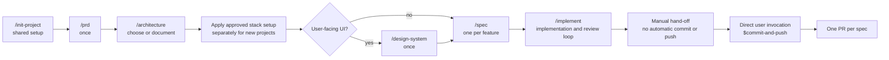
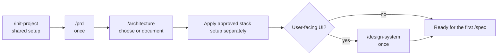
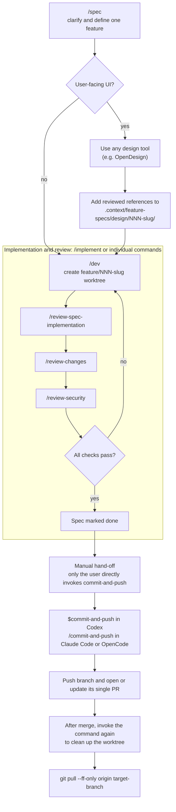

> **To initialize a project from this starter, clone the repo and run:**
>
> ```
> /init-project
> ```

# agentic-starter

A stack-agnostic starter for building projects with Codex, Claude Code, OpenCode, or another local coding agent, following a **Spec-Driven Development (SDD)** workflow. It ships the agentic tooling layer only - no application code - so it works with whatever backend, frontend, and hosting you choose.



## What's included

- **`.context/`** - the project's persistent context: architecture, conventions, progress tracking, feature specs, and a small memory system for decisions and corrections. See `.context/ai-workflow-entrypoint.md` for the full read order.
- **`.context/project-settings.md`** - project-specific settings: target branch, PR confirmation, optional design workspace URL, and the test/typecheck commands the pipeline runs. Every spec uses one feature branch and one PR.
- **`.context/stacks/`** - stack-specific architecture and setup recipes. `/architecture` may consult them as examples after learning the product constraints; they are not a closed menu, and `/init-project` never selects or executes one. Apply an approved recipe separately after the architecture decision.
- **`.context/coding-conventions/`** - shared rules plus language/framework guidance for supported stacks. Keep these reference files intact; read the ones matching the architecture documented in `.context/architecture.md`.
- **Commands and agents**, mirrored across tools (`.codex/`, `.claude/`, `.opencode/`) so the workflow is the same regardless of which local coding agent you use:
  - `/init-project` → `/prd` → `/architecture` → approved stack setup (separate step, if needed) → `/design-system` for UI projects - framing before the first `/spec`
  - `/spec` → `/implement` - the feature pipeline (implementation, spec verification, conventions, and security review, looped until clean)
  - `/status` - shows the project's framing state and every spec's pipeline stage, derived entirely from files and read-only git/gh queries
  - `/review-changes`, `/review-security` - convention/security sweeps over local changes
  - `/init-project` - set up shared project context and workflow settings without choosing a stack
  - `/setup-backup`, `/setup-rolling-deploy`, `/teardown-rolling-deploy` - infra runbooks (currently only implemented for the `symfony-nextjs-contabo` recipe)
  - `/commit-and-push`, `/add-new-color`, `/just-respond`
- **`infra/`** - reference deploy scripts and nginx configurations for the supported stack recipes; stack-specific setup is applied separately.
- **`.github/workflows/`** - CI/CD examples matching the current stack recipes; they are not installed or selected by `/init-project`.
- **`.githooks/pre-commit`** - a plain git hook (not tool-specific): refuses a commit on a `feature/<slug>` branch unless that spec exists and `/dev` has picked it up. Activated once per clone when `/init-project` initializes the shared workflow (`git config core.hooksPath .githooks`), so it applies regardless of which AI tool is committing.

**Commit and push require a direct user command.** `$spec`, `$dev`, `$implement`, quick fixes, and reviews never commit, push, or invoke the commit-and-push command automatically. Only when you directly call `$commit-and-push` in Codex or `/commit-and-push` in another tool does the agent run its commit and push workflow.

## AI Development workflow

Context and conventions live in `.context/` - start with `.context/ai-workflow-entrypoint.md` (also linked from `AGENTS.md`/`CLAUDE.md`).

The command names below use slash notation for readability. Codex invokes the matching dollar-prefixed skill (for example, `$spec`, `$implement`, and `$commit-and-push`); Claude Code and OpenCode use slash commands. All three follow the same canonical instructions in `.context/commands/`.

**Two paths:**

**Quick fixes** (bugs, typos, small corrections - ≤ 3 files, no new feature): write code directly, no pipeline needed.

**Features**: framing once, then the per-spec pipeline repeats for every feature:

```
/init-project → /prd → /architecture → approved stack setup (if needed) → /design-system (UI projects) → /spec
/spec → /implement                     (repeats, once per feature)
```

### Framing (once)

Run `/init-project` to populate shared project context and workflow settings without choosing a stack. Then run `/prd` and `/architecture` manually, one at a time. For a new project, apply approved stack-specific setup separately if needed; run `/design-system` for UI projects once the UI stack and its tokens exist. `/spec` is blocked until shared initialization, the PRD, architecture, and (for UI projects) the design system are complete. Repeat framing later only if the documented product or architecture has drifted.



| Command | What it does |
| --- | --- |
| `/init-project` | Sets up shared project context and workflow settings; does not choose or bootstrap a stack |
| `/prd` | Frames the product: problem, perimeter, out-of-scope, success criteria - writes `.context/framing/prd.md` |
| `/architecture` | Chooses and documents architecture for a new project, or documents the actual architecture of an existing codebase |
| `/design-system` | UI projects only - locks design tokens and a contrast audit into `.context/ui-context.md` |

### Per-spec cycle

Each spec gets its own dedicated git worktree, `.worktrees/NNN-slug/` on branch `feature/NNN-slug` - one spec, one worktree, one branch, one PR. `/dev` creates it and brings the spec and any versioned design references into it; every later command resolves that worktree rather than assuming the session is already sitting inside it. `/commit-and-push` removes it only after the PR is proven merged.



| Command | What it does |
| --- | --- |
| `/spec` | Explicitly classifies whether the feature has user-facing UI. UI specs may use any design tool (OpenDesign is one example) and include reviewed, versioned design references under `.context/feature-specs/design/`; non-UI specs skip design. The spec and handoff are shared across coding agents. |
| `/implement` | Runs `/dev` → `/review-spec-implementation` → `/review-changes` → `/review-security` in series, looping (up to 5 iterations) until everything checks out, and marks the spec done |

`/implement` is the recommended entry point for a feature - it's `/dev`, `/review-spec-implementation`, `/review-changes`, and `/review-security` wired together into one self-correcting loop. It never commits or pushes: `/commit-and-push` is always a separate, manual step after `/implement` hands off. Each of the four stays available individually for a narrower job (e.g. running `/review-security` alone after a manual edit).

Specs live in `.context/feature-specs/` as Markdown files with `status: todo / in-progress / done`. UI design references live in `.context/feature-specs/design/<NNN-slug>/` and travel with the spec branch. `/commit-and-push` pushes that branch and opens or updates its single PR against `Target branch`. Run `/status` at any point to see framing, design handoff, worktree, verification, and PR state.

After the PR merges and `/commit-and-push` safely cleans up its worktree, fast-forward the primary checkout with `git pull --ff-only origin <target-branch>` before starting the next spec.

### Design tools and local coding agents

Use any design process that fits the project: a design workspace such as Figma or OpenDesign, another design application, or existing local references. The coding agent prepares a design brief; you review the design and place relevant, versionable references and assets in `.context/feature-specs/design/<NNN-slug>/`. The local agent reads those committed files from the feature worktree; it does not connect to or inspect the live design workspace. A workspace URL is optional, and this file handoff does not require provider-specific MCP setup.

## Getting started

Run `/init-project` to set up shared project context and workflow settings. For an existing codebase where you only want architecture documented, run `/architecture` directly; it creates only `.context/architecture.md` when `.context/` is absent.

Each developer machine also needs the GitHub CLI installed and authenticated (`gh auth login`) to open, inspect, and clean up per-spec pull requests. `/init-project` checks this prerequisite without storing credentials in the repository.

### Updating an already initialized project

Do not rerun `/init-project` when the shared project settings are already populated. When updating an existing project, merge the canonical command files and tool wrappers from the starter, preserving the project's actual target branch, test, and typecheck values in `.context/project-settings.md`:

- All relevant canonical command files under .context/commands/, especially init-project, prd, architecture, design-system, spec, dev, implement, status, review commands, and commit-and-push.
- The corresponding native command wrappers under `.claude/commands/`, `.codex/skills/`, and `.opencode/commands/`; they should delegate to the canonical files.
- The `.context/stacks/` recipes relevant to the project's approved architecture, if they are kept in that project.

Remove the old `Merge mode` setting and add `Design workspace URL:` if the project has a preferred browser-based design tool; use `-` if it does not. If the settings file has the legacy `OpenDesign URL:` key, rename it while preserving its value. Completed legacy specs do not need retroactive UI metadata or design references; new specs created with the updated `/spec` command use the tool-agnostic handoff. On each developer machine, install and authenticate `gh` once, then sign in to the selected design tool in a browser if needed. Design references live in the feature branch, so the local coding agent does not need a separate design-tool MCP installation.

## Security review rule updates

`$review-security` in Codex (`/review-security` in Claude Code and OpenCode) keeps `.context/coding-conventions/security.md` as the project's authority and uses the [OWASP Secure Coding Markdown compilation](https://github.com/vchirrav-eng/owasp-secure-coding-md) for supplementary rule IDs. The shared updater downloads only `rules/*.md` into the Git ignored `.cache/security-rules/` directory. Agents run it from `.context/ai-workflow-entrypoint.md` when a session starts; it checks upstream at most once every seven days after a successful download, retries failed refreshes at the next session, and keeps the last valid snapshot if the network is unavailable. Review reports include the source commit SHA.

For an existing project created from an older starter, migrate its workflow files once: copy `.context/scripts/update-security-rules.py`, merge the new startup instruction into `.context/ai-workflow-entrypoint.md`, and merge `.context/commands/review-security.md` plus the matching `.claude/commands/`, `.codex/skills/`, `.opencode/commands/`, and `security-reviewer` agent definitions. Add `.cache/security-rules/` to `.gitignore`, then remove the old `security-review-ecc` skill copies and references. Preserve that project's own `security.md` and any local review customizations. The first session after migration downloads the rules.

On a new computer, clone the project and make sure Python 3 and Git are available. The first session needs network access to create the cache. Because the upstream repository currently declares no redistribution license, this starter does not commit a copy of its rules; a new clone without network access cannot complete the supplementary review until its first download succeeds.

## Built with

[Claude Code CLI](https://claude.ai/code)
