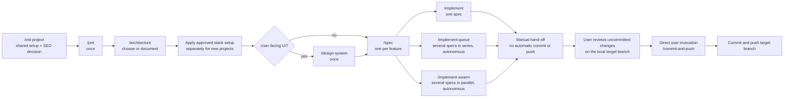
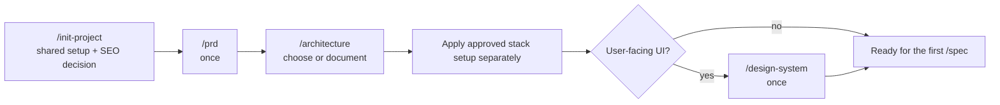
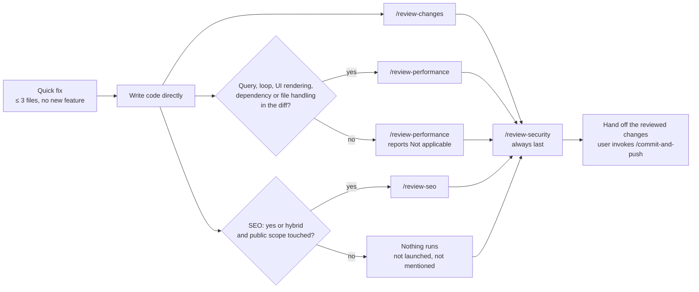
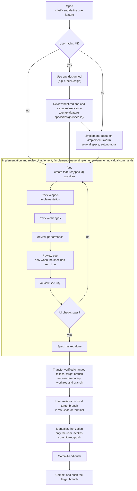
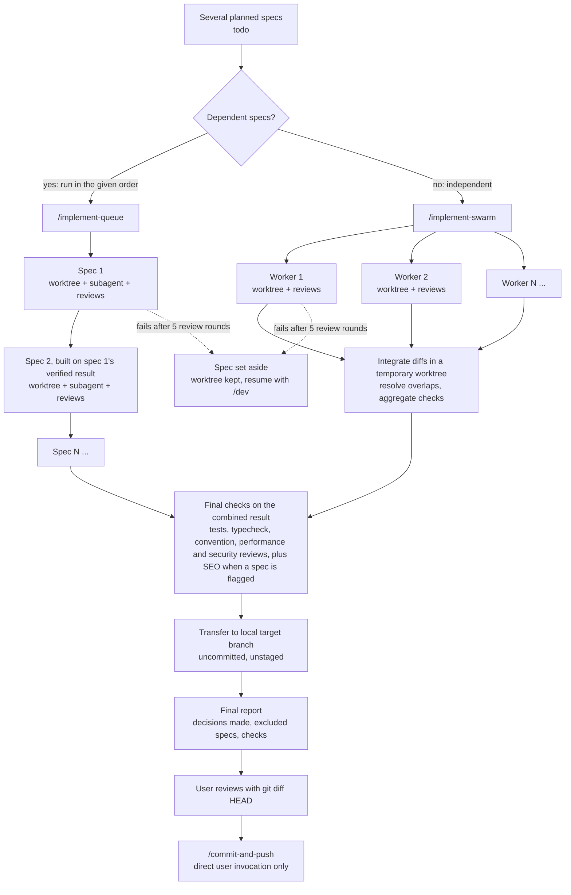
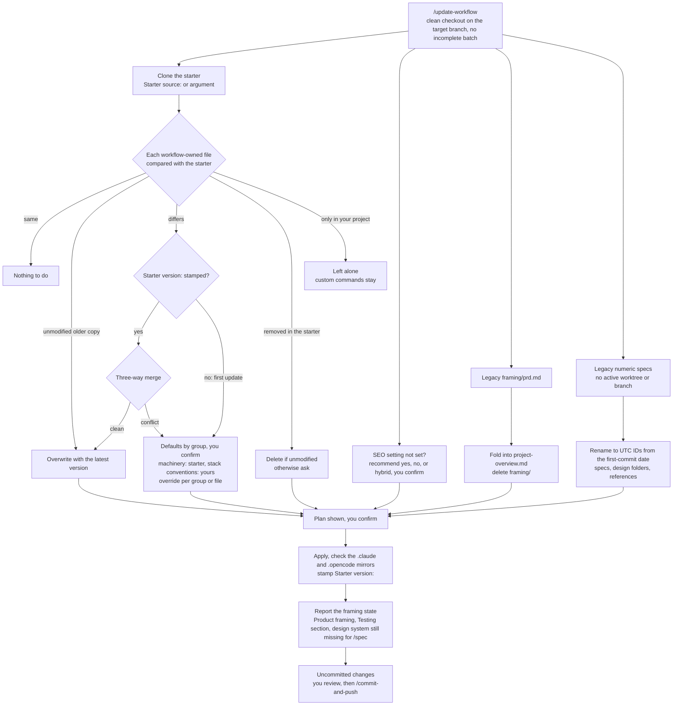

> **To start a new project, clone this repo. To add the starter workflow to an existing project, copy the starter files into it. Then run:**
>
> ```
> /init-project
> ```
>
> To bring a project that already uses the starter up to date later, run `/update-workflow`.

# agentic-starter

A stack-agnostic starter for building projects with Claude Code, OpenCode, or another local coding agent, following a **Spec-Driven Development (SDD)** workflow. It ships the agentic tooling layer only - no application code - so it works with whatever backend, frontend, and hosting you choose.



## Summary

A complete overview of the starter for readers who want everything in one place. Each part is detailed in the sections below.

### What it is

- **A tooling layer, not an application.** No app code: persistent project context (`.context/`), slash commands, specialized subagents, hooks, and conventions that make a coding agent work spec first.
- **Spec-Driven Development.** Nothing consequent is built without a written spec, and every spec is verified against its acceptance criteria.
- **Tool-agnostic.** The canonical logic lives once in `.context/commands/`; thin wrappers mirror it for Claude Code (`.claude/`) and OpenCode (`.opencode/`).
- **Local and user-controlled Git.** No pull requests. Verified work lands uncommitted on your local target branch; only your direct `/commit-and-push` commits and pushes.
- **Guided by two layers of rules.** An Absolute Directive (think before coding, simplicity first, surgical changes, goal-directed execution) and stack conventions, enforced by automatic reviews.

### The lifecycle

| Stage | When | What happens |
| --- | --- | --- |
| 1. Install | Once per project | Clone the starter for a new project, or copy its files into an existing one, then run `/init-project` |
| 2. Framing | Once per project | `/init-project` → `/prd` → `/architecture` → approved stack setup → `/design-system` (UI projects). `/spec` stays blocked until it is complete |
| 3. Features | Every feature | `/spec` → `/implement` (or `/implement-queue` / `/implement-swarm` for several specs). Implementation, spec verification, then the reviews, looped up to 5 times until clean |
| 4. Quick fixes | Small changes (≤ 3 files, no new feature) | Write the code directly; the agent then runs `/review-changes`, `/review-performance`, `/review-seo` (only on SEO-flagged work), and `/review-security` |
| 5. Handoff | After every verified change | The changes sit uncommitted on the target branch; you review with VS Code or `git diff HEAD`, then invoke `/commit-and-push` |
| 6. Inspect | Any time | `/status` shows the framing state and every spec's pipeline stage, read-only |
| 7. Keep current | When the starter evolves | `/update-workflow` brings the project's workflow files up to date and migrates legacy numeric specs |

### Every command

| Group | Command | What it does |
| --- | --- | --- |
| Framing | `/init-project` | Sets up shared project context and workflow settings, and settles whether the project is SEO-friendly (`yes`, `no`, or `hybrid`), without choosing a stack |
| | `/prd` | Frames the product once: problem, perimeter, out-of-scope, success criteria |
| | `/architecture` | Chooses and documents the architecture, including the test tools (`## Testing`), or documents an existing codebase |
| | `/design-system` | UI projects only: locks design tokens and a contrast audit into `.context/ui-context.md` |
| Features | `/spec` | Plans a feature after the framing gate: research, questions, design brief for UI specs, spec file with acceptance criteria and its `ui:` and `seo:` flags |
| | `/dev` | Implements one spec in its own worktree and branch, following the TDD loop, and writes the test map into the spec |
| | `/implement` | Recommended entry point: `/dev` plus every review in a self-correcting loop (max 5 iterations), then the handoff |
| | `/implement-queue` | Autonomous: several specs in series, each on top of the previous verified result, ending with a decision report |
| | `/implement-swarm` | Autonomous: several independent specs in parallel, integrated and reviewed together, ending with a decision report |
| Reviews | `/review-spec-implementation` | Verifies every acceptance criterion, data-model field, and API contract against real code; the only command that marks a spec `done` |
| | `/review-changes` | Checks changed files against the coding conventions and TDD rules, runs static analysis, and fixes violations |
| | `/review-performance` | Checks the diff for N+1 queries, unbounded lists, request waterfalls, leaks, heavy imports; fixes real costs only |
| | `/review-seo` | Flagged work only (`SEO:` `yes` or `hybrid`, and `seo: true` on the spec; public scope only), otherwise neither launched nor mentioned: checks metadata, canonical and robots, crawlable markup and links, status codes, structured data; fixes real defects |
| | `/review-security` | Checks the diff against `security.md` and relevant OWASP rules; always last, and owns the final handoff |
| Project | `/status` | Read-only framing state and per-spec pipeline stage, with next-command suggestions |
| | `/update-workflow` | Updates an existing project's workflow files to the latest starter, settles the SEO setting, and migrates legacy specs |
| Ship | `/commit-and-push` | Commits and pushes the reviewed target-branch changes; only runs when you invoke it |
| Utilities | `/add-new-color` | Adds a design token (Tailwind CSS-variable systems) |
| | `/rebuild-tailwind` | Rebuilds the Tailwind CSS output with the stack's build command |
| | `/just-respond` | Answers in text only: no edits, no commands |
| Infra runbooks | `/setup-backup`, `/setup-rolling-deploy`, `/teardown-rolling-deploy` | Database backup and rolling zero-downtime deploy, currently for the `symfony-nextjs-contabo` recipe |

### The review pipeline

| Order | Review | Subagent | Looks at | Fixes in place |
| --- | --- | --- | --- | --- |
| 1 | `/review-spec-implementation` | `spec-verifier` | Acceptance criteria, data model, API contract | Flags gaps, never invents behavior |
| 2 | `/review-changes` | `convention-reviewer` | Coding conventions, placement rules, lint, tests against `tdd.md` | Yes |
| 3 | `/review-performance` | `performance-reviewer` | Cost the diff introduces, per stack (`coding-conventions/performance/`) | Yes, with concrete cost and bounded fix only |
| 4 | `/review-seo` | `seo-reviewer` | Public pages against `seo.md` and `html.md`, only for flagged work (`SEO:` `yes` or `hybrid`, spec `seo: true`) | Yes, never invents titles, descriptions, or copy |
| 5 | `/review-security` | `security-reviewer` | Project `security.md` plus OWASP Secure Coding rules (refreshed at most weekly) | Yes |

On the quick path the order is changes, performance, SEO, then security last. `/review-performance` reports "Not applicable" by itself unless the diff has a query or network call, a loop, UI rendering, a dependency change, or file handling. `/review-seo` is flagged work: with `SEO: no`, or a spec whose `seo:` flag is `false` (set by `/spec`, like `ui:`, and `true` for `hybrid` only when the spec touches the public scope), it is neither launched nor mentioned in any report, handoff message, or status suggestion. When launched and nothing in the public scope changed, it returns "Not applicable" silently. Other subagents: `implementer` (builds from precise instructions) and `codebase-researcher` (grounds a spec in analog features and best practices).

### Specs and isolation

- **Spec ID:** `yyyy_mm_dd_hh_ii_ss-spec-title` (UTC). Older `NNN-slug` IDs stay supported until migrated by `/update-workflow`.
- **One spec, one worktree, one branch:** `.worktrees/<spec-id>/` on `feature/<spec-id>`, removed after a verified handoff.
- **Per-spec files:** the spec (with its `ui:` and `seo:` frontmatter flags), a design brief and visual references for UI specs under `.context/feature-specs/design/<spec-id>/`, and a `## Test map` section at the end of the spec.
- **Batches:** `/implement-queue` and `/implement-swarm` keep a resumable manifest under `.worktrees/.parallel-batches/`; an incomplete batch blocks new work until it is resumed.

### Guardrails that run automatically

| Guardrail | Effect |
| --- | --- |
| `.claude/hooks/check-request-scope.sh` (prompt hook) | Suggests `/spec` first when a request looks like substantial feature work |
| `.claude/hooks/enforce-spec-pipeline.sh` (pre-write hook) | Refuses writes to application code while a spec is in progress with unchecked criteria |
| `.githooks/pre-commit` | Refuses a commit on `feature/<spec-id>` unless that spec exists and `/dev` has picked it up |
| Spec framing gate | `/spec` stops until `/init-project`, the product framing in `project-overview.md`, architecture (with `## Testing`), and the design system are complete |
| Commit and push gate | Nothing commits or pushes unless you directly invoke `/commit-and-push` |
| Mandatory review gate | Every direct code edit is followed by the reviews before the work counts as done |

### What lives in `.context/`

| Path | Role |
| --- | --- |
| `project-overview.md`, `architecture.md`, `infra.md`, `ui-context.md` | The project's framing: product (problem, perimeter, success criteria, constraints), architecture, infrastructure, design tokens |
| `project-settings.md` | `Target branch:`, `Design workspace URL:`, `Test command:`, `Typecheck command:`, `SEO:` (`yes`, `no`, `hybrid`), `SEO public scope:`, `Starter source:`, `Starter version:` |
| `progress-tracker.md`, `feature-specs/` | Work in progress, specs (each ends with its test map) |
| `coding-conventions/` | `global.md`, `security.md`, `tdd.md`, `html.md`, `seo.md`, `performance/`, and one file per supported stack |
| `stacks/` | Stack recipes: `symfony-nextjs-contabo`, `symfony-twig-stimulus` |
| `adr/`, `memory/` | Decisions with rejected alternatives, and corrections or validated approaches, both loaded automatically, with no command |
| `commands/`, `security-rules/`, `ai-workflow-*.md` | Canonical commands, the committed OWASP rules snapshot, the entrypoint and workflow rules |

**Supported stacks:** Symfony API with API Platform, Symfony with Twig and Stimulus, Next.js, and Gatsby, with TypeScript, JavaScript, React, PHP, HTML, Tailwind, and UI conventions. PHP runs on FrankenPHP, static analysis is PHPStan (level 8, locally and in the GitHub workflow), and JavaScript dependencies are managed with pnpm. Each stack file is modeled on a real reference project.

**Quality rules in force:** a red-green-refactor TDD loop per acceptance criterion for business logic and bug fixes, with test tools chosen per stack at `/architecture` time; the simplicity ladder from the Absolute Directive; per-stack performance rules; HTML and SEO rules for SEO-friendly projects; and OWASP-backed security review.

## What's included

- **`.context/`** - the project's persistent context: architecture, conventions, progress tracking, feature specs, and a small memory system for decisions and corrections. See `.context/ai-workflow-entrypoint.md` for the full read order.
- **`.context/project-settings.md`** - project-specific settings: target branch, optional design workspace URL, and the test/typecheck commands the pipeline runs. Each spec gets a temporary local worktree and branch; verified changes are reviewed on the local target branch. The workflow creates no PRs.
- **`.context/stacks/`** - stack-specific architecture and setup recipes. `/architecture` may consult them as examples after learning the product constraints; they are not a closed menu, and `/init-project` never selects or executes one. Apply an approved recipe separately after the architecture decision.
- **`.context/coding-conventions/`** - shared rules plus language/framework guidance for supported stacks (Symfony API and Twig fullstack, Next.js, Gatsby, plus TDD, security, performance, and styling). Each stack file is modeled on a real reference project and describes its `src/` layout. Keep these reference files intact; read the ones matching the architecture documented in `.context/architecture.md`.
- **Commands and agents**, mirrored across tools (`.claude/`, `.opencode/`) so the workflow is the same regardless of which local coding agent you use:
  - `/init-project` → `/prd` → `/architecture` → approved stack setup (separate step, if needed) → `/design-system` for UI projects - framing before the first `/spec`
  - `/spec` → `/implement` - the feature pipeline (TDD implementation, spec verification, conventions, performance, security, and for SEO-flagged specs SEO review, looped until clean)
  - `/implement-queue` - autonomously implements several specs one after another, each on top of the previous verified result, and ends with a decision report
  - `/implement-swarm` - autonomously implements several independent specs concurrently, integrates their verified diffs, and ends with a decision report
  - `/status` - shows the project's framing state and every spec's pipeline stage, derived entirely from files and read-only Git queries
  - `/review-changes`, `/review-performance`, `/review-seo`, `/review-security` - convention/performance/SEO/security sweeps over local changes (`/review-seo` only on SEO-friendly projects)
  - `/init-project` - set up shared project context and workflow settings without choosing a stack
  - `/setup-backup`, `/setup-rolling-deploy`, `/teardown-rolling-deploy` - infra runbooks (currently only implemented for the `symfony-nextjs-contabo` recipe)
  - `/update-workflow` - updates an existing project's workflow files (`.context/`, `.claude/`, `.opencode/`, git hooks) to the latest starter version and migrates legacy numeric specs to UTC IDs
  - `/commit-and-push`, `/add-new-color`, `/rebuild-tailwind`, `/just-respond`
- **`infra/`** - reference deploy scripts and nginx configurations for the supported stack recipes; stack-specific setup is applied separately.
- **`.github/workflows/`** - CI/CD examples matching the current stack recipes; they are not installed or selected by `/init-project`.
- **`.githooks/pre-commit`** - a plain git hook (not tool-specific): refuses a commit on a `feature/<spec-id>` branch unless that spec exists and `/dev` has picked it up. The normal workflow transfers reviewed changes to the target branch before the user-authorized commit. Activated once per clone when `/init-project` initializes the shared workflow (`git config core.hooksPath .githooks`), so it applies regardless of which AI tool is committing.

**Commit and push require a direct user command.** `/spec`, `/dev`, `/implement`, `/implement-queue`, `/implement-swarm`, quick fixes, and reviews never commit, push, or invoke the commit-and-push command automatically. Only when you directly call `/commit-and-push` does the agent run its commit and push workflow.

## AI Development workflow

Context and conventions live in `.context/` - start with `.context/ai-workflow-entrypoint.md` (also linked from `AGENTS.md`/`CLAUDE.md`).

The command names below use slash notation for readability. Claude Code and OpenCode both use slash commands (for example, `/spec`, `/implement`, and `/commit-and-push`) and follow the same canonical instructions in `.context/commands/`.

### Framing (once)

Run `/init-project` to populate shared project context and workflow settings without choosing a stack. It also settles the SEO question as one of three values stored in `.context/project-settings.md`: **yes** (the whole user-facing product is SEO-friendly), **no** (nothing is indexed), or **hybrid** (a public part is SEO-friendly and the rest, typically an authenticated dashboard, is not, with the public scope listed in `SEO public scope:`). `yes` and `hybrid` turn on `.context/coding-conventions/seo.md` and `/review-seo`, and `/spec` then flags each spec with `seo: true` or `false` so the review is launched, and mentioned, only for work that touches the SEO-relevant part; `html.md` applies to all markup either way. Then run `/prd` and `/architecture` manually, one at a time. For a new project, apply approved stack-specific setup separately if needed; run `/design-system` for UI projects once the UI stack and its tokens exist. `/spec` is blocked until shared initialization, the product framing, architecture, and (for UI projects) the design system are complete. Repeat framing later only if the documented product or architecture has drifted.



| Command | What it does |
| --- | --- |
| `/init-project` | Sets up shared project context and workflow settings, including whether the project is SEO-friendly (`yes`, `no`, or `hybrid` with a public scope); does not choose or bootstrap a stack |
| `/prd` | Frames the product: problem, perimeter, out-of-scope, success criteria, constraints - writes them into `.context/project-overview.md` |
| `/architecture` | Chooses and documents architecture for a new project, or documents the actual architecture of an existing codebase |
| `/design-system` | UI projects only - locks design tokens and a contrast audit into `.context/ui-context.md` |

### Day-to-day work: two paths

**Features** (the main path): once framing is done, the per-spec pipeline repeats for every feature:

```
/init-project → /prd → /architecture → approved stack setup (if needed) → /design-system (UI projects) → /spec
/spec → /implement                     (repeats, once per feature)
```

Use `/implement-queue <spec-id-or-file> <spec-id-or-file> [...]` when at least two already planned specs are ready and should run one after another (put dependencies first), or `/implement-swarm <spec-id-or-file> <spec-id-or-file> [...]` when they are independent and can run concurrently. Both run autonomously and never commit. You can pass exact IDs or drag and drop the `.md` spec files into any of these commands; their local `file:///...` URLs are resolved and checked against the current checkout. `/dev` and `/implement` accept the same file selectors, along with their existing name-fragment lookup.

**Quick fixes** (bugs, typos, small corrections - ≤ 3 files, no new feature): write code directly, no pipeline needed. Once the code is written, the agent runs `/review-changes` and `/review-performance`, plus `/review-seo` on SEO-flagged work, then `/review-security` last. `/review-performance` reports "Not applicable" on its own when the diff has no query or network call, loop, UI rendering, dependency change, or file handling, and `/review-seo` is launched only when the project is `SEO: yes` or `hybrid` (silent when the diff leaves the public scope). With `SEO: no` it is not launched or mentioned at all.



### Per-spec cycle

Each new spec uses a UTC ID in `yyyy_mm_dd_hh_ii_ss-spec-title` format (for example, `2026_09_27_15_42_31-add-search`). It gets its own temporary worktree, `.worktrees/<spec-id>/`, on a local branch `feature/<spec-id>` - one spec, one worktree, one branch, no PR. Existing numeric spec IDs remain supported. `/dev` creates the worktree and brings the spec and its design handoff into it; later commands resolve that worktree rather than assuming the session is already sitting inside it. Once implementation, spec verification, convention review, performance review, SEO review, and security review pass, the verified changes are transferred to the configured local target branch as uncommitted, unstaged changes. The worktree and feature branch are removed after the transfer is verified.



| Command | What it does |
| --- | --- |
| `/spec` | Explicitly classifies whether the feature has user-facing UI. UI specs may use any design tool (OpenDesign is one example) and include reviewed, versioned design references under `.context/feature-specs/design/`; non-UI specs skip design. The spec and handoff are shared across coding agents. |
| `/implement-queue` | Autonomous serial run: implements and reviews each selected spec in its own worktree on top of the previous verified result, then hands the combined uncommitted changes to the target branch with a decision report |
| `/implement-swarm` | Autonomous parallel run: implements and reviews multiple independent specs concurrently, integrates their diffs for local review, and records resumable cleanup state |
| `/implement` | Runs `/dev` → `/review-spec-implementation` → `/review-changes` → `/review-performance` → `/review-seo` (only for specs with `seo: true`) → `/review-security` in series, looping (up to 5 iterations) until everything checks out, and marks the spec done |

`/implement` is the recommended entry point for a feature - it's `/dev`, `/review-spec-implementation`, `/review-changes`, `/review-performance`, `/review-security`, and, for specs with `seo: true`, `/review-seo` wired together into one self-correcting loop. It never commits or pushes: `/commit-and-push` is always a separate, manual step after `/implement` hands off. Each of the six stays available individually for a narrower job (e.g. running `/review-security` alone after a manual edit).

Specs live in `.context/feature-specs/` as Markdown files with `status: todo / in-progress / done`. New UI specs persist a design brief at `.context/feature-specs/design/<spec-id>/brief.md`; reviewed visual references and relevant assets live alongside it and travel with the spec worktree. The brief alone does not count as a reviewed visual reference; the user may explicitly approve a prose-only design. After review, the handoff places the changes on the local `Target branch` for manual inspection. `/commit-and-push` commits and pushes that target branch only after the user directly invokes it. Run `/status` at any point to see framing, design handoff, worktree, verification, and local-branch state.

After the user has reviewed and committed/pushed the local target-branch changes, the normal spec worktree is already gone and the target checkout is ready for the next spec. No second invocation or post-merge pull is needed. A queue or swarm batch normally removes the worktrees of every spec it transferred before handoff; if cleanup is interrupted, `/status` reports the manifest and `resume <batch-id>` on the command that started it (`/implement-queue` or `/implement-swarm`) safely resumes it before more implementation starts.

### Autonomous spec batches



`/implement-queue` and `/implement-swarm` are for unattended runs. Start one, walk away, and read the final report. Neither ever commits or pushes: the result lands uncommitted on the local target branch, and only your later `/commit-and-push` commits it. During the run they never ask you anything; ambiguities are decided by the agent following the spec, the conventions, and accepted ADRs, and every decision is listed in the final report with its reason and rejected alternative. A spec that fails after five review rounds is set aside (its worktree and branch are kept, `status: in-progress`, resumable with `/dev <spec-id>`) while the others continue. The shared rules are in `.context/commands/autonomous-mode.md`.

`/implement-queue <spec-id-or-file> <spec-id-or-file> [...]` runs the specs one after another in the given order. Each gets its own worktree, subagent, and review loop, and starts from the verified result of the previous spec, so later specs can depend on earlier ones. The combined result is checked once more and transferred at the end.

#### Parallel batch (`/implement-swarm`)

`/implement-swarm <spec-id-or-file> <spec-id-or-file> [...]` starts one implementation worker per selected `todo` spec. You can drag and drop spec files such as `file:///D:/Projects/my-app/.context/feature-specs/006-dashboard-stats.md`; the shared resolver confirms each file belongs to this checkout and derives its exact spec ID. Each worker uses its own `.worktrees/<spec-id>/` and `feature/<spec-id>` branch. The primary agent waits for every worker, runs the spec, convention, performance, and security reviews (plus SEO for specs with `seo: true`), combines their uncommitted changes in an isolated integration worktree, resolves overlaps, runs aggregate checks, and transfers the complete result to the local target branch as uncommitted, unstaged changes.

No feature worker creates commits, so this is patch-based three-way integration rather than `git merge --no-commit`. The ignored `.worktrees/.parallel-batches/<batch-id>/manifest.json` records each phase and cleanup operation. If execution is interrupted, `/status` reports the batch and its remaining worktrees; resume with `/implement-swarm resume <batch-id>` (or `/implement-queue resume <batch-id>` for a queue). The command never deletes a worktree until the full transfer to the target checkout is verified. New specs and batches wait until an incomplete batch is recovered and the target-branch changes have been reviewed and committed by the user.

### Test-driven development

Every agent that writes code follows the red-green-refactor loop in `.context/coding-conventions/tdd.md`, one acceptance criterion at a time: the tests that pin the criterion, the minimum code to pass them, refactor, next criterion. This is deliberately not "write all the tests first", which lets an AI anticipate and over-build. It is mandatory for business logic (services, domain rules, state processors, security filters, hooks and schemas carrying business rules) and for bug fixes. UI components get component tests only when they carry behavior, and Playwright e2e tests cover only the journeys the spec marks as critical; simple CRUD, serialization groups, trivial utilities, config, generated files, pure markup/styling, and migrations are verified by running them.

- **Tools are chosen per stack.** `/architecture` fills a mandatory `## Testing` table in `.context/architecture.md` (backend unit and integration, frontend logic, components, e2e), and `/spec` is blocked until it is complete. Stack recipes under `.context/stacks/` provide defaults.
- **Acceptance criteria drive the cycles.** Each criterion that touches business logic becomes one red-green cycle with one to three test cases, worked from simplest to richest; a criterion that is pure UI, markup, styling, copy, or configuration is marked "verified manually" with the method used.
- **Evidence.** The implementing agent records a `## Test map` (one row per criterion: its tests, or "verified manually" and how) at the end of the spec. `/review-spec-implementation` checks that every criterion is mapped or verified and can run a neutralization check on criteria guarding security or data integrity (break the logic, confirm its test goes red, restore); `/review-changes` checks that tests assert behavior rather than mirror the implementation.
- **Browser verification.** After UI work the agent checks the result in a real browser, using Claude in Chrome under Claude Code and Playwright elsewhere. That is inspection only; committed e2e tests use Playwright.

### Design tools and local coding agents

Use any design process that fits the project: a design workspace such as Figma or OpenDesign, another design application, or existing local references. `/spec` saves a self-contained `brief.md`; review it, create or inspect the design in your preferred tool, then place the reviewed visual references and relevant assets beside it under `.context/feature-specs/design/<spec-id>/`. For derived screens, the brief describes changes from the existing screen instead of repeating its design. The local coding agent reads the files synchronized into the feature worktree; it does not connect to or inspect the live design workspace. After verified handoff, the spec and design references are preserved in the local target checkout. A workspace URL is optional, and this file handoff does not require provider-specific MCP setup. Supplied HTML and other active content are inspected as source and never executed; use a screenshot or static export for visual review.

## Getting started

For a new project or an existing project that does not yet have `.context/`, run `/init-project` first. It inspects the existing codebase and initializes shared project context without choosing or bootstrapping a stack. Then run `/prd` followed by `/architecture`, apply any approved stack setup separately, and run `/design-system` if the project has a UI. `/architecture` alone is only the narrow documentation path when you want to record an existing project's architecture; it creates only `.context/architecture.md` and does not replace `/init-project` or unlock `/spec`.

The workflow does not require the GitHub CLI. Configure the project's `origin` remote and local target branch so the user-authorized `/commit-and-push` command can push after local review.

### Updating an already initialized project

Do not rerun `/init-project` when the shared project settings are already populated. Run `/update-workflow` instead, once per repository (a workspace folder holding several repositories is not a project: run it inside each one). It clones the starter named by `Starter source:` in `.context/project-settings.md`, or the git URL or local path you pass as its argument, and changes only what the starter owns:

| Class | Files | What the command does |
| --- | --- | --- |
| Workflow-owned | `.context/commands/`, `security-rules/`, `stacks/`, `coding-conventions/` (except `security.md`), `ai-workflow-*.md`; `.claude/` and `.opencode/` commands, agents, and hooks; `.githooks/` | Adds, updates, or deletes them |
| Merge-only | `.claude/settings.json`, `.gitignore`, `.gitattributes`, `AGENTS.md`, `CLAUDE.md`, `.context/project-settings.md` | Adds what the starter has and the project lacks, never removes local content (a framework-generated block in `AGENTS.md` survives) |
| Project-owned | overview, architecture, tracker, specs, ADRs, memory entries, `security.md`, README, changelog, `infra/`, code, and any custom command of yours | Never touched, except the spec renames below |

**First update versus later ones.** A project copied from an older starter has no `Starter version:` stamp, and its files often predate the starter's history, so the command cannot know which differences are your customizations. It never guesses a merge base: each differing file becomes a conflict, decided by group with one confirmation. Workflow machinery (commands, agents, hooks, `global.md`, `tdd.md`) defaults to the starter's version; stack convention files and recipes default to yours. You can flip a group or choose per file, and because the working tree must be clean, anything replaced is recoverable from Git. The command then stamps `Starter version:`, so later updates do a real three-way merge against it and only ask about true conflicts. If the project has no `project-settings.md` yet, the command asks for the target branch (default: the current one) and creates it; fill in `Test command:` and `Typecheck command:` afterwards.



**Spec migration.** Legacy `NNN-slug` specs get a UTC ID from the date of their first commit, kept strictly increasing in numeric order so specs committed together keep their original order. The rename covers the spec file, its design folder, and every reference in the Markdown files the update does not take from the starter, including application resources outside `.context/`. References inside accepted ADRs are retargeted too (only the reference text changes) and the plan lists those files. Specs with an active worktree or `feature/<spec-id>` branch keep their numeric ID until their handoff; run `/update-workflow` again afterwards. Mentions that cite only a spec number (for example "spec 006") are not rewritten, and old IDs remain in Git history.

**Legacy PRD.** A project framed with the earlier `.context/framing/prd.md` has that file folded into `project-overview.md` (Problem into the Overview if missing, perimeter into Scope, success criteria, constraints, reference product), then `framing/` is deleted. You confirm the merged result in the plan.

**SEO setting.** An older project has no `SEO:` value, so the command recommends one from what the project shows (`hybrid` when it has public pages and a logged-in area, with a drafted public scope), and you confirm or change it in the plan. An existing value is never overridden.

**After the update.** An older project usually lacks the product framing that `/spec` now requires, so the report lists the framing commands to run next (`/prd` when the overview lacks scope, success criteria or constraints, `/architecture` for the `## Testing` section, `/design-system` for UI projects). Obsolete leftovers outside the workflow's reach, such as the old `security-review-ecc` skill folder, are yours to delete. The command also removes the retired `Merge mode` and `Ship confirmation` settings and renames a legacy `OpenDesign URL:` key to `Design workspace URL:`, preserving its value. Existing pull requests or remote feature branches are not changed automatically; resolve any old pipeline work separately before switching to this local-review workflow. The command never commits or pushes.

**Expected effort.** Roughly 10 to 25 minutes per repository for a project with dozens of specs, most of it spent reading the plan and confirming the defaults (an estimate from a dry run, not a measurement). A project that is already stamped and has no legacy specs takes a few minutes.

## Security review rule updates

`/review-security` keeps `.context/coding-conventions/security.md` as the project's authority and uses the [OWASP Secure Coding Markdown compilation](https://github.com/vchirrav-eng/owasp-secure-coding-md) for supplementary rule IDs. The starter commits the snapshot under `.context/security-rules/` (`rules/*.md` plus `source.json` with the upstream commit), so a project needs no network, Python, or first download, and every machine reviews against the same rules. Review reports include the source commit SHA.

A weekly GitHub Action in the starter (`.github/workflows/update-security-rules.yaml`) clones the upstream, and when its commit differs from `source.json` opens a pull request that must be reviewed before merge, because the rules are reference data fed to the security review. The starter repository must allow GitHub Actions to create pull requests. Projects receive the snapshot through `/update-workflow` like any other workflow file; they never refresh it themselves, and their own `security.md` is preserved. A project that earlier ran its own updater script or Action deletes `.github/workflows/update-security-rules.yaml` and any old `.cache/security-rules/` folder itself, and `/update-workflow` removes the retired `.context/scripts/` folder. Delete the old `security-review-ecc` skill copies yourself.

The upstream repository currently declares no redistribution license. The starter owner accepts that: every project repository is private and holds a copy of the rules. Revisit this if the upstream adds a license or if a project becomes public.

---

<p align="center"><strong>Authored by Jean Rakotoarison</strong></p>
